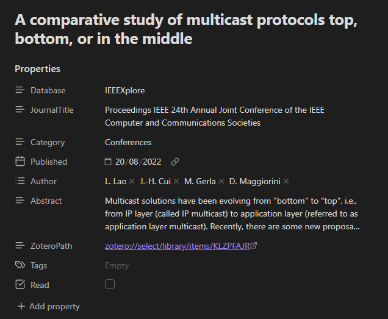
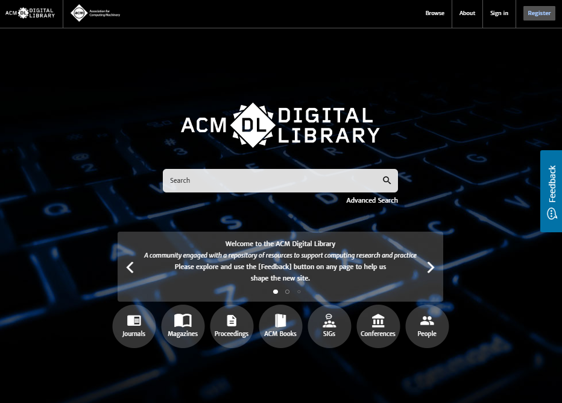

# 📚 DataNotes Templates & Obsidian Clipper
This repository contains a collection of templates I personally use for my knowledge vaults, primarily managed using [Obsidian](httpsobsidian.md).
While not all templates are perfect, they represent my current workflow for structuring and tracking information from various sources, ranging from academic research to entertainment. I welcome any suggestions for improvements or new sources!

---
## 🧪 Academic Research & DataNotes Database
The templates under the Database_DataNotes folder are primarily designed for academic use and personal curiosity. They are a continuously growing resource, currently containing sources I have encountered during my studies and research.
### 📝 Core ArticleConference Template
The template I use for all DataNotes concerning academic articles and conference papers follows this structure:

This template is adapted to my specific workflow:
- Obsidian as a TrackerDatabase I use Obsidian primarily as a high-level database or tracker. I create a `.base` note here to maintain a complete overview of the article, including its status (e.g., whether it has been fully read or not).
- Zotero for Annotation The main action focus shifts to [Zotero](httpswww.zotero.org). I consider Zotero the superior tool for managing and annotating academic and university-level book material. All strict article-related notes are taken directly within Zotero.
- Connecting the Tools To seamlessly link the two applications, I use the [Zutilo](httpsgithub.comwshanksZutilo) Zotero extension. This allows me to create direct links that open the specific item in the Zotero application, embedding them into my Obsidian DataNote for quick access. (I am aware of Obsidian's Zotero plugins, but I feel they force the use of Obsidian for virtually everything, which I prefer to avoid.)
## 🔍 Academic Search Resources
My primary method for finding articles is using [Google Scholar](httpsscholar.google.com). Below are the key sources it directs me to, which I use for my research
### ScienceDirect
[ScienceDirect](httpswww.sciencedirect.com) is the gateway to millions of academic articles published by Elsevier, 1.4 million of which are open access. Journals and books can be searched via a single interface.
- Coverage approx. 19.5 million items
- Discipline Multidisciplinary
- Access options Free
- Provider Elsevier

---
### JSTOR
[JSTOR](httpswww.jstor.org) is a valuable resource for finding research papers. Any article published before 1924 in the United States is available for free, and JSTOR also offers scholarships for independent researchers.
- Coverage more than 12 million items
- Discipline Multidisciplinary
- Access options Free
- Provider ITHAKA

---
### IEEE Xplore
[IEEE Xplore](httpsieeexplore.ieee.orgXplorehome.jsp) is the leading academic database in the field of engineering and computer science. It includes journal articles, conference papers, standards, and books.
- Coverage approx. 6 million items
- Discipline Engineering
- Access options Free
- Provider IEEE (Institute of Electrical and Electronics Engineers)

---
### ACM Digital Library
The [ACM Digital Library](httpsdl.acm.org) is the world's most comprehensive database for full-text articles and bibliographic literature in computing and information technology. It includes academic journals, conference proceedings, newsletters, and technical magazines published by ACM.
- Coverage Over 3 million entries (bibliographic records and full-text articles)
- Discipline Computer Science, Information Technology
- Access options Institutional Subscription (Transitioning to ACM Open model)
- Provider ACM (Association for Computing Machinery)

---
### MDPI (Multidisciplinary Digital Publishing Institute)
[MDPI](httpswww.mdpi.com) is a leading global publisher of Open Access scientific journals. It publishes a high volume of peer-reviewed articles across a wide range of disciplines, operating on an APC (Article Processing Charge) model paid by authors or their institutions.
- Coverage Over 430 academic journals (with hundreds of thousands of articles published annually)
- Discipline Multidisciplinary (Science, Engineering, Medicine, Biology, etc.)
- Access options Open Access (free for readers)
- Provider MDPI (Multidisciplinary Digital Publishing Institute)

---
## 🎬 Personal Hobbies & Entertainment Templates
This section contains templates I use for leisure reading and watching, though they can also be adapted for academic or study material from certain websites. These templates are categorized by the source they are designed to track:

### 📖 Books & Comics/Manga

| **Platform**                                 | **Type**              | **Notes**                                                       |
| -------------------------------------------- | --------------------- | --------------------------------------------------------------- |
| [Goodreads](https://www.goodreads.com/)      | Book Tracking/Reviews | Global book community and tracking.                             |
| [Feltrinelli](https://www.lafeltrinelli.it/) | Italian Bookstore     | For tracking books from a major Italian retailer.               |
| [Mangatoro](https://mangataro.org/home)      | Manga/Comics          | For structured tracking of Japanese comics.                     |
| [Weeb Central](https://weebcentral.com/)     | Anime/Manga/News      | For general tracking of Japanese media.                         |
| [Toonily](https://toonily.com/)              | Comics/Manhwa/Manhua  | (Yes, I know what you're thinking, and you're not wrong, haha!) |

### 🎥 Movies & Generic

| **Platform**                                     | **Type**              | **Notes**                                                      |
| ------------------------------------------------ | --------------------- | -------------------------------------------------------------- |
| [IMDb](https://www.imdb.com/it/?ref_=hm_nv_home) | Movie/TV Database     | The Internet Movie Database for general tracking.              |
| [Letterboxd](https://letterboxd.com/)            | Movie Social Tracking | For reviews and social tracking of films.                      |
| [YouTube](https://www.youtube.com/)              | Video Content         | A generic template for tracking and documenting video content. |

